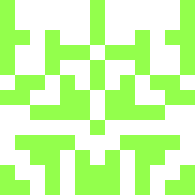
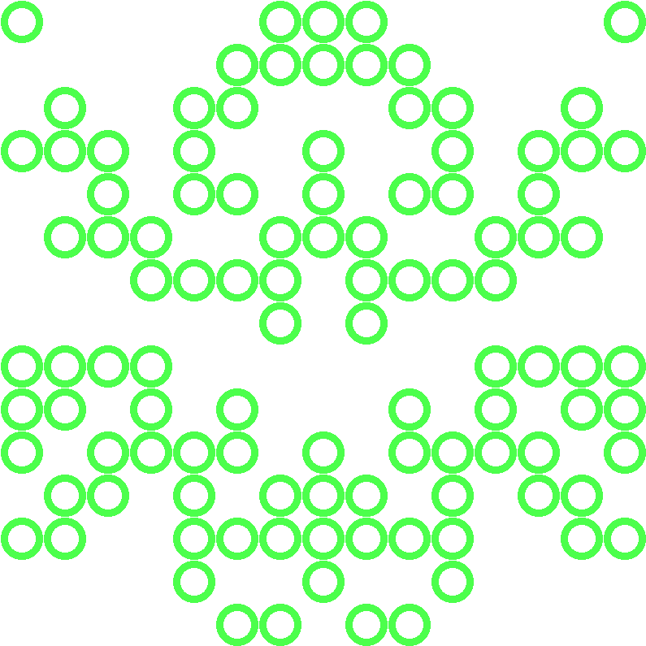

Simple script that converts a username into a github-like identicon.

Can be run from the command line using
```
ruby identicon.rb HEIGHT USERNAME CIRCLES(TRUE/FALSE)
```
The following identicons are generated using my username:

HEIGHT = 3


HEIGHT = 5


HEIGHT = 7


HEIGHT = 9


HEIGHT = 11


HEIGHT = 13



HEIGHT = 15. Getting funky with circles.


